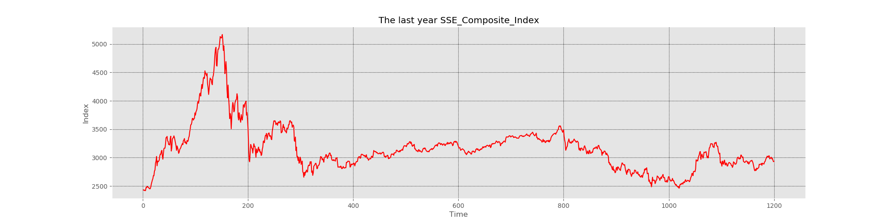

## Regular Investment Demo

It's a regular investment demo, to help you understand this strategy.

If you are no aware of regular investment, you'd better google it for a general understanding.

This demo just help you to understand it, but not teach you.

这是一个定投策略的小demo，帮助你理解定投策略。

如果你对定投完全不了解，那最好还是先去查资料心里有个数。

这篇demo旨在帮助你理解定投，而不是教会你 : ) 

***

#### ISSUES

If you have any recommended suggestions, please leave me a issue, I will try my
best to achieve your requirements. Such as make a applets on wechat, even
though I can not achieve it now.

如果您有任何的建议，请直接提交issue，我会尽力满足您的需求。比如说想在微信端实现小程序来跑这个demo，尽管我现在还不会 :)

***

#### ATTENTION PLEASE

**INVESTMENT IS RISKY**

**投资有风险**

***

#### To do list

- [x] fix strategy 每期固定资本投资
- [ ] covering strategy 每期补仓投资
- [ ] picture show

#### The SSE Composite Index

