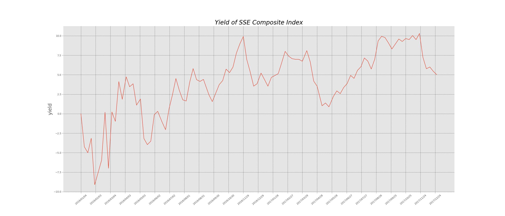

## Regular Investment Demo

It's a regular investment demo, to help you understand this strategy.

If you are no aware of regular investment, you'd better google it for a general understanding.

This demo just help you to understand it, but not teach you.

***

这是一个定投策略的小demo，帮助你理解定投策略。

如果你对定投完全不了解，那最好还是先去查资料心里有个数。

这篇demo旨在帮助你理解定投，而不是教会你 : ) 


### ISSUES

If you have any recommended suggestions, please leave me a issue, I will try my
best to achieve your requirements. Such as make a applets on wechat, even
though I can not achieve it now.

***

如果您有任何的建议，请直接提交issue，我会尽力满足您的需求。比如说想在微信端实现小程序来跑这个demo，尽管我现在还不会 :)


### ATTENTION PLEASE

**INVESTMENT IS RISKY**

**投资有风险**


### How to use

```shell
python count.py --strategy=fix --start_time=2016-1-1 --interval=5 --money=1000 --duration=1 --index=1
```

- **Result**
```shell
     index       time
0  2347.72  2014-9-26
1  2357.71  2014-9-29
2  2363.87  2014-9-30
3  2382.79  2014-10-8
4  2389.37  2014-10-9
Curve of SSE Composite Index has saved in /home/yichao.li/fund/pics/SSE-Composite-Index.png

Your start time is not a trading day. So I postpone it to the next trading day.

Your strategy of investment is    fix

           Start investment at    2016-01-04
             End investment at    2017-01-03
        Investment duration is    1 year(s)
        Investment interval is    5 trading day(s)
         Captial investment is    1000.00 RMB

         Your captial money is    49000.00 RMB
  Your ruturn of investment is    50888.19 RMB

           Your final yield is    3.85%
          Your annual yield is    3.85%

       Your final max yield is    9.91%
      Your annual max yield is    9.91%
 Your yield curve has saved in    /home/yichao.li/fund/pics/Yield-of-SSE-Composite-Index.png
```

- **Argument Explain**

1. strategy

```shell
--strategy=fix
--strategy=covering
```
It means that which investment strategy you use to test, **fix** means in every trading day, you invest fixed money on fund whatever the magnitude of index. In contrast, **covering** means  you invest not fixed money on fund according to  the magnitude of index.

***

这个参数是可选的投资策略，fix意味着每一期都投资固定的金额，covering意味着会根据基金指数情况选择合适的投资金额。


2. start_time

```shell
--start_time=2016-1-1 
```
It mens that when to start to invest, time after 2016-1-1 is available. 

***

代表什么时候开始投资，2016-1-1以后的日期都有效。


3. interval

```shell
--interval=5 
```
It means interval day, 1 means every day, 5 means every week, 21 means every month.

***

投资的时间间隔，1代表每天投资，5代表每周投一次，21代表每月投一次。


4. money

```shell
--money=1000 
```
It means capital money in trading day.

***

代表每期投资的本金额


5. duration

```shell
--duration=1 
```
It means how many years you want to invest.

***

投资年限


6. index

```shell
--index=1
```
It means which index you choose to test, optional index is in [1, 2, 3, 4, 5]

1 refer to SSE Composite Index,000001;

2 refer to SZSE Component Index,399001;

3 refer to SSE 50 Index,000016;

4 refer to CSI 300 Index,399300;

5 refer to CSI Smallcap 500 index,000905.

***

代表要测试哪一个指数，可选的在[1, 2, 3, 4, 5]中

1 是上证指数

2 是深圳指数

3 是上证50

4 是沪深300

5 是中证500


- Picture Show


